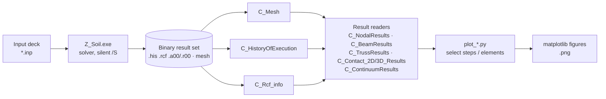
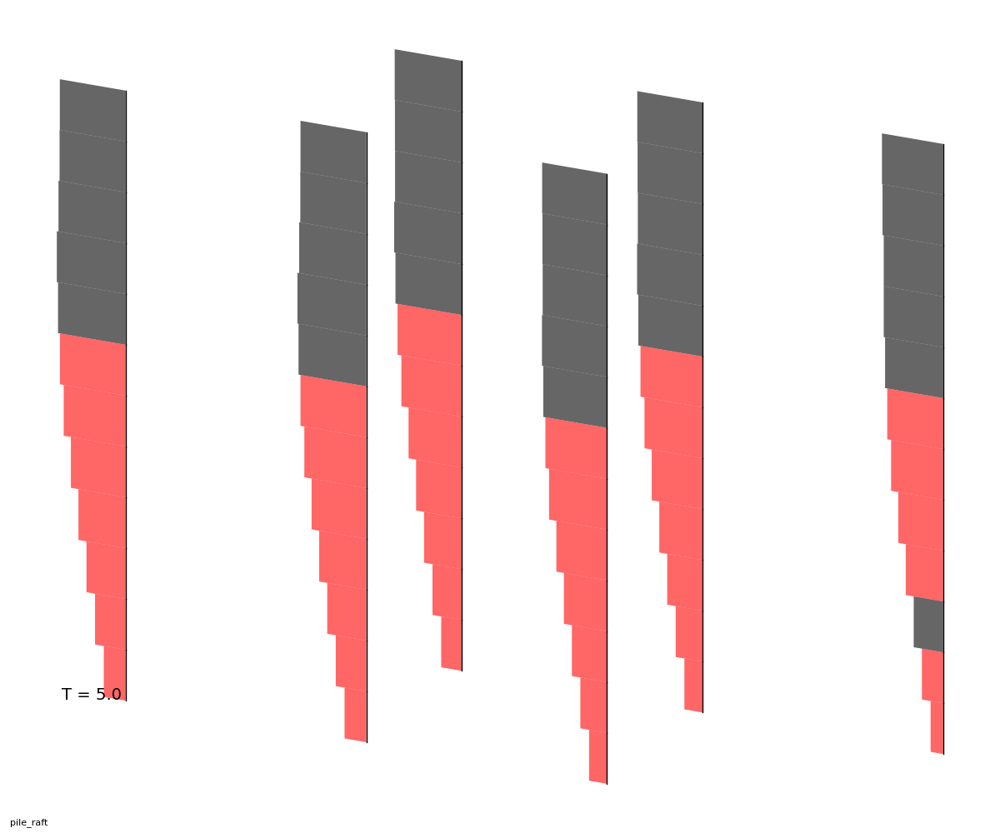
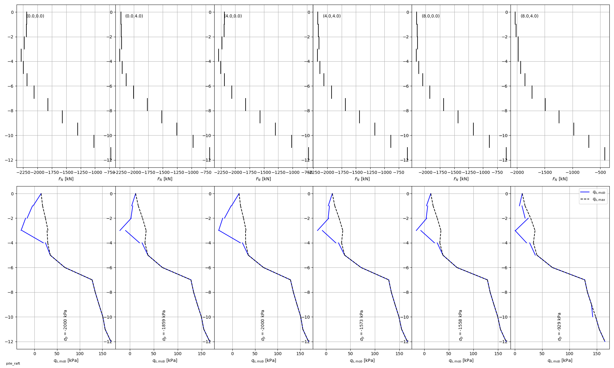
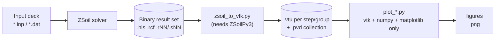

# zsoil-output-examples

A collection of examples using ZSoilPy to process ZSoil results.

## Installation

Clone the repository to your local machine:
   ```bash
   git clone https://github.com/ZSoil-FEM/zsoil-output-examples.git
   ```

The scripts import the `ZSoilPy3` package from the ZSoil installation directory (see the
`sys.path.append(...)` line near the top of each script) — running them requires a local
ZSoil install, not just this repository.

## What's in here

Three worked examples, each pairing a ZSoil input deck with a set of Python scripts that
read the solver's result files and turn them into figures:

| Example | Problem | Scripts |
|---|---|---|
| [`BerlinSand/`](BerlinSand) | Braced excavation retained by an anchored diaphragm wall | `run_all.py` + 5 `plot_*.py` modules |
| [`PileFoundation/`](PileFoundation) | 3×2 pile group under a raft | `plot_piles_3D.py`, `plot_piles_diagrams.py` |
| [`vtk-examples/3Ddeepex/`](vtk-examples/3Ddeepex) | 3D braced excavation with diaphragm walls (shell elements) | `extract_vtk.py` + 3 `plot_*.py` modules, on top of the shared `vtk-examples/zsoil_to_vtk.py` exporter |

## Extraction pipeline

Every script follows the same three-stage shape: open the mesh and result history,
select the elements/steps of interest, then hand the resulting arrays to matplotlib.
`run_all.py` is the only script that also drives the solver itself; it then calls the
five Berlin Sand plotting scripts in sequence.



## Berlin Sand — braced excavation

`run_all.py` copies the `.inp` deck into a scratch `res-files/` directory, runs the
solver against it, calls the five scripts below in order, then deletes the scratch
directory. `steps_to_plot` and `step_labels` at the top of `run_all.py` control which
construction stages get plotted.

| Script | Selects | Extracts (API) | Produces |
|---|---|---|---|
| `plot_nodal_maps.py` | All volumic elements at the final stage; wall beams (mat 3); anchor trusses (mat 4–6) | `C_NodalResults.get_nodes_displacements` | Triangulated mesh colored by resultant nodal displacement, deformed shape overlaid with wall + anchors — `disp_map_<prob>` |
| `plot_element_maps.py` | Same volumic set, one stress component | `Continuum_EleResults.get_rsl_for_sel_elements(..., 'STRESSES')` | Deformed mesh colored by element horizontal stress σxx — `Sxx_map_<prob>` |
| `plot_excavation2D.py` | Wall beams at each requested excavation stage | `Beam_EleResults.get_moment_for_sel_elements`, `get_force_for_sel_elements`; `NodalResults.get_nodes_displacements` | Bending moment, shear force and horizontal displacement profiles vs. depth, one curve per stage — `wall_<prob>` |
| `plot_interfaces.py` | Wall interface (mat 7) and anchor interfaces (mat 9), same stages | `Contact_2D_Results.get_rsl_vec_for_sel_elements` for `STRESSES`, `STR_LEVEL`, `PLA_CODE` | Normal earth-pressure profile behind the wall, plus mobilized anchor friction split by row — `earth_pressures_<prob>`, `anchors_<prob>` |
| `plot_time_histories.py` | Every converged, non-stability-driver step | Same beam/nodal/truss readers, tracked as running envelopes | Four evolution charts vs. construction step: max wall displacement, max settlement, max ± bending moment, force per anchor row — `wall_disp_evol_<prob>`, `settlement_evol_<prob>`, `bending_moment_evol_<prob>`, `anchor_force_evol_<prob>` |

## Pile Foundation — 3D piled raft

Piles are beams (mat 9) wrapped in shaft interfaces (mat 8) and tip interfaces
(mat 10). Both scripts identify individual piles by rounding each element's (x, z)
footprint to a dictionary key — there's no explicit pile numbering in the model.

| Script | Selects | Extracts (API) | Produces |
|---|---|---|---|
| `plot_piles_3D.py` | Pile beams and shaft interfaces, one figure per time step | `Beam_EleResults.get_forces_vec_for_sel_elements`; `Contact_3D_Results...'PLA_CODE'` | A custom oblique 3D→2D projection of the whole pile group, segment thickness/color coded by axial force and shaft plasticity — `pile_raft_FN_T<step>` |
| `plot_piles_diagrams.py` | Beams + shaft/tip interfaces, grouped into individual piles by (x, z) location | `Contact_3D_Results` stresses & stress level; beam forces | A subplot pair per pile: axial force N(z), and mobilized (q<sub>s,mob</sub>) vs. maximum available (q<sub>s,max</sub>) shaft friction, with tip resistance annotated — `pile_raft_frott_T<step>` |

Example output at T=5.0:

<table>
<tr>
<td></td>
<td></td>
</tr>
<tr>
<td><sub><code>pile_raft_FN_T5_0.png</code> — red segments mark shaft interface elements at plastic code 16 (fully mobilized)</sub></td>
<td><sub><code>pile_raft_frott_T5_0.png</code> — one column per pile; dashed line is available friction, solid is mobilized</sub></td>
</tr>
</table>

## VTK export pipeline

`vtk-examples/` takes a different approach from the two examples above: instead of
every plotting script reading the ZSoil result files directly, one shared exporter
(`zsoil_to_vtk.py`) turns the mesh + results into a ParaView-readable VTK time series
once, and everything downstream reads *that* — mostly without touching ZSoilPy3 at all.



Three shared files live directly in `vtk-examples/`, used by every example folder
underneath it (currently just `3Ddeepex/`):

| File | Purpose |
|---|---|
| `zsoilpy_env.py` | Locates ZSoilPy3 on disk (same helper as `BerlinSand/`/`PileFoundation/`) |
| `zsoil_to_vtk.py` | Exports one project to `.vtu`/`.pvd` (`export_to_vtk()`); the only file here that needs ZSoilPy3 |
| `vtk_cut_utils.py` | `CutPlane`, `project_on_plane`, `GetDiscreteColormap`, `get_tstr` — no ZSoilPy3 dependency, shared by every cross-section script |

`export_to_vtk()` controls which steps, element groups and result arrays get written
(`DEFAULT_ELEMENT_ARRAYS`) — including, for `SHELLS`, `BEAMS` and 3D `CONTACT`
elements, each element's own local coordinate axes (`LocalX`/`LocalY`/`LocalZ`, from
`get_element_local_axes()`). That's what lets `plot_wall_diagrams.py` resolve bending
moment and shear about the model's own vertical direction correctly for a wall facing
*any* way, using plain numpy on the exported arrays — without reopening the ZSoil
project.

## 3Ddeepex — 3D braced excavation

A rectangular excavation retained by diaphragm walls (`SHELLS`, one material per wall
face) and props, modeled in 3D. `extract_vtk.py` exports the steps/groups this example
needs; the three `plot_*.py` scripts each cut the exported mesh with one or more
vertical planes (`CutPlane`, from `vtk_cut_utils.py`) and plot the intersection.

| Script | Selects | Extracts (API) | Produces |
|---|---|---|---|
| `extract_vtk.py` | — | `zsoil_to_vtk.export_to_vtk(...)` | `.vtu`/`.pvd` for the groups/steps this example needs, under `pv/` |
| `plot_geology_profiles.py` | VOLUMICS elements crossed by each cut plane | `Material` cell array from the `.vtu`; material labels via ZSoilPy3 `Mesh` | Cross-section colored by material, legended by name — `<prob>_geol_<title>.png` |
| `plot_result_profiles.py` | Same cut planes; `nodal` or `element` mode | A chosen nodal (e.g. `DISP_TRA`) or element (e.g. `STRESSES`) field/component, straight from the `.vtu` | Cross-section colored by that field: filled contours (`tricontourf`) for nodal, flat cell patches for element — `<prob>_<field>-<comp>_<mode>_<title>.png` |
| `plot_wall_diagrams.py` | SHELLS wall elements crossed by a plane, near one along-wall location | Raw `SMOMENT`/`SQFORCE` + `LocalX`/`LocalY`/`LocalZ` + `DISP_TRA`, all from the `.vtu` — no ZSoilPy3 | Horizontal displacement, bending moment and shear force vs. altitude — `<prob>_wall_diagrams_<title>.png` |

Example output, wall diagrams at T=6:

<table>
<tr>
<td></td>
<td></td>
</tr>
<tr>
<td><sub>North wall (running east-west) — same script, same physical quantities as the East wall despite the 90° different orientation</sub></td>
<td><sub>East wall (running north-south)</sub></td>
</tr>
</table>

## ZSoilPy3 API surface used

`BerlinSand/` and `PileFoundation/` touch: `C_Mesh`, `C_HistoryOfExecution`,
`C_Rcf_info`, `C_NodalResults`, `C_BeamResults`, `C_TrussResults`,
`C_Contact_2D_Results`, `C_Contact_3D_Results`, and `C_ContinuumResults`.
`vtk-examples/` needs the SDK only for `zsoil_to_vtk.py` itself (plus material labels
in `plot_geology_profiles.py`); the rest of that pipeline runs on `vtk`/`numpy`/
`matplotlib` alone once the `.vtu` files exist.
